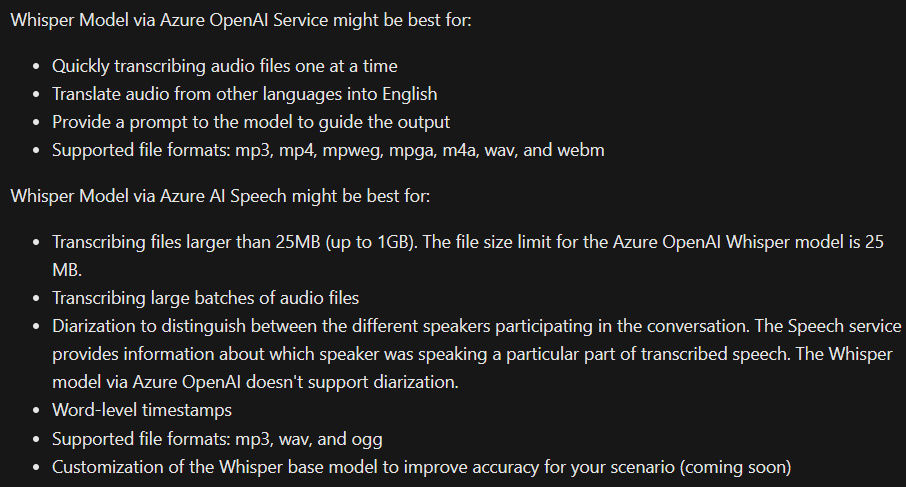
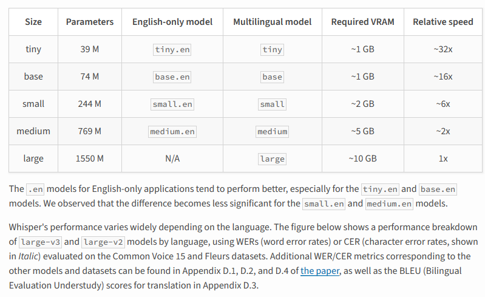
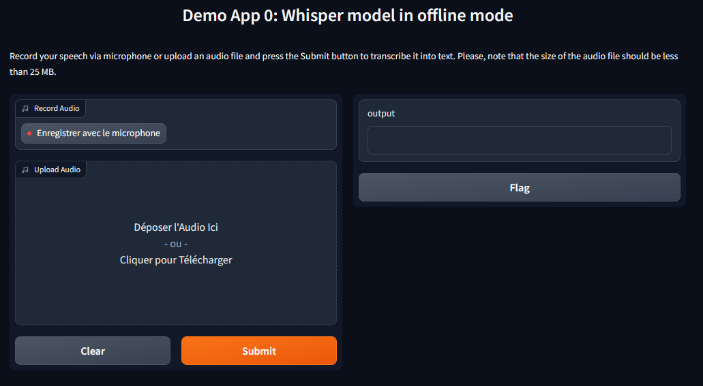
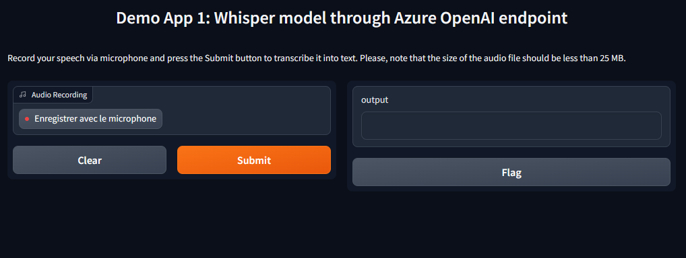
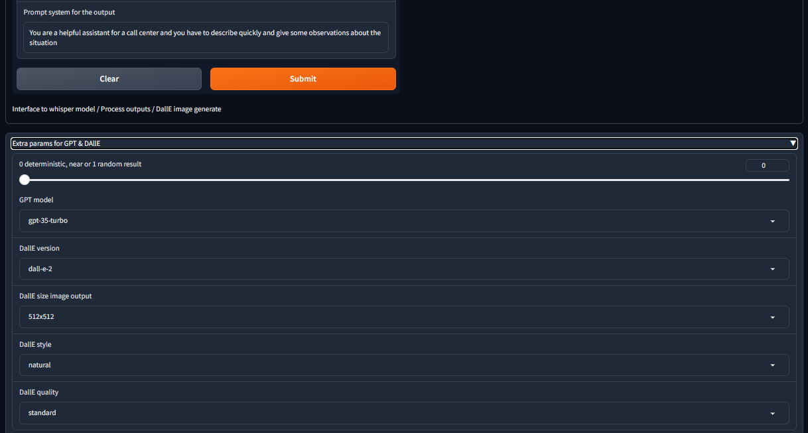

# Demo Whisper / GPT / DallE in the Gradio-powered Web apps

Whisper models allow you to transcribe and translate audio files, using their speech-to-text capabilities.
> If you want to know more about the possibilities for Whisper [visit this link](https://learn.microsoft.com/en-us/azure/ai-services/speech-service/whisper-overview)
> To discover the languages supported [visit this link](https://github.com/openai/whisper) - Actually the last version is V3 ( in open AI is still in V2 apis call )

There are difference between use Whisper by azure Ai speech or use whisper by Azure open Ai service for [different feature visit this link to know the possilities](https://learn.microsoft.com/en-us/azure/ai-services/speech-service/whisper-overview#whisper-model-via-azure-ai-speech-or-via-azure-openai-service)

Extract from the documentation



Dall-E model allow you to transform text to image or prompt to image, so in simple terms it draws pictures based on your description
- [Cookbook for Dall-E3](https://cookbook.openai.com/articles/what_is_new_with_dalle_3)


We will display how to utilise Whisper models offline or consume them through an Azure endpoint (either from [Azure OpenAI](https://learn.microsoft.com/en-us/azure/ai-services/openai/overview) or [Azure AI Speech](https://learn.microsoft.com/en-GB/azure/ai-services/speech-service/overview) resources).

You can access have the access to the portal [Azure AI speech on this link](https://speech.microsoft.com/portal/)


The Table of contents below is wrapped into a functional Web interface, powered by [Gradio](https://www.gradio.app/)

## Table of contents:
- [0 - Access to Whisper models in offline mode / local](#0---access-to-whisper-models-in-offline-mode)
- [1 - Access to Whisper models via Azure OpenAI endpoint](#option-1---access-to-whisper-models-via-azure-openai-endpoint1---access-to-whisper-models-via-azure-openai-endpoint)
- [2 - Access to Whisper models via Azure AI Speech endpoint](#2---access-to-whisper-models-via-azure-ai-speech-endpoint)
- [3 - Access to whisper via Azure OpenAI endpoint / process by gpt / generate with Dall-E](#option-3---whisper-model--processing-gpt-and-dall-e-generation)


## Option 0 - Access to Whisper models in offline mode / local
Whisper model can be consumed offline. You may notice differences in its performance on the weaker local computers in comparison to an Azure based deployment. At the same time, this may serve certain scenarios where access to external resources is prohibited or not possible.

To instantiate Web app with offline Whisper functionality, please follow these steps:
1. Install gradio Python package. This will allow you to define and instantiate a Web app, that will run locally as a Web service.
```
pip install --upgrade gradio
```

2. Install openai-whisper Python package. 
It comes with a few pre-trained Whisper models of various sizes. E.g. "base" model may require ~1 Gb of RAM, while "large" one would expect ~10 Gb of RAM.

> if you want to select other Whisper model  inside the notebook you will have to change this line with the correct name

````whisper.load_model("base")````


```
pip install --upgrade openai-whisper
```

> **Note:** You may also require installation of [FFMpeg package](https://ffmpeg.org/) to make this solution work on your local computer.

```
pip install ffpmpeg
```

3. Launch provided Python script for offline Web app.
```
python 0_Whisper_Offline.py
```
If successful, you should be able to access new Web app's interface at http://127.0.0.1:7860/ as shown below. You can now record your speech through the computer's microphone and transcribe it using one of selected Whisper models.



## Option 1 - Access to Whisper models via Azure OpenAI endpoint

Whisper models are now available as a part of Azure OpenAI resource. To consume its API endpoint in your Gradio app, please follow these steps:
1. Create a deployment and Deploy Whisper in available Azure OpenAI region in ***[The Azure openAi studio](https://oai.azure.com/portal/)**
2. Go to the [azure portal](https://portal.azure.com/) to select the deployment.

2. Copy API endpoint and key details.


3. Install gradio Python package. This will allow you to define and instantiate a Web app, that will run locally as a Web service.
```
pip install --upgrade gradio
```
4. Install openai Python package. This is the client SDK that your Web app will use to interact with Azure OpenAI endpoint or Open Ai model if you need it
```
pip install --upgrade openai
```
5. Launch provided Python script for a Web app, integrated with Azure OpenAI endpoint.
```
python 1_Whisper_AOAI_endpoint.py
```
If successful, you should be able to access new Web app's interface at http://127.0.0.1:7860/ as shown below. You can now record your speech through the computer's microphone and transcribe it using Whisper model enabled in Azure OpenAI.


## Option 2 - Access to Whisper models via Azure AI Speech endpoint - URI access
:construction:
:octocat: don't work now :octocat:

:construction:
Whisper models are also available through Azure AI Speech. Using batch API (similar to what is described [here](https://github.com/Azure-Samples/cognitive-services-speech-sdk/tree/master/samples/batch/python/python-client)), can increase audio file size limit up to 1 Gb.

```
pip install --upgrade azure-cognitiveservices-speech
```
You could find some information for using whisper models in Azure speech [inside this page](https://learn.microsoft.com/en-us/azure/ai-services/speech-service/batch-transcription-create?pivots=rest-api#using-whisper-models)

This demo is based on [this link](https://github.com/Azure-Samples/cognitive-services-speech-sdk/blob/master/samples/batch/python/README.md)

## Option 3 -  Whisper model / processing GPT and Dall-E generation
This last demo is the more advanced with diffrent tabs and possiblity to customize your choice in the bottom in the page



In your terminal in visual studio code or powershell / cmd
```
python 3_Whisper_process_dalle.py
```
You will have the information in terminal cmd
```
Running on local URL:  http://127.0.0.1:7860
```
You could open your webbrowser at the localhost adress shown  http://127.0.0.1:7860


